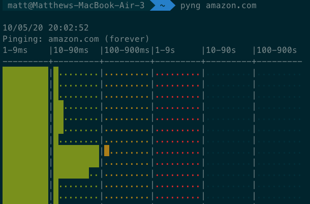

# Pyng
A Python ``ping`` wrapper for pretty and fast network assessment.

## Screenshot
Here is a screenshot of Pyng in action:

## Installation
Run ``pip install pyng3``, or ``pip3 install pyng3``

## Requirements
- Python 2.7+ or Python 3+
- pip or pip3 (to install)
- Mac/Linux

## How to Use
Run ``pyng`` or ``pyng3``.  You must supply a host to ping.  Specify the number of pings with -p.  Show help with -h.

## Features
- colorized output for easy visualization
- log scale to handle all ranges of latency
- specify host and number of pings (-1 is infinite)
- < 80 characters wide!
- Tested with Python 2.7 and Python 3.6

## Un-Features
- Not tested on Linux
- No support for specifying ping rate
